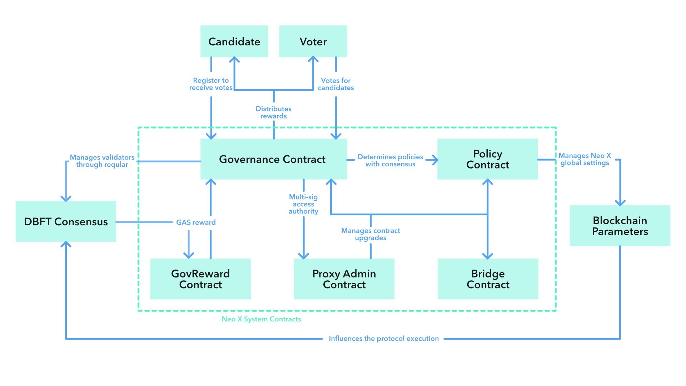

# Neo X System Contracts

Neo X system contracts are a set of build-in Solidity contracts with predefined addresses. They represent the governance and economic model of Neo X, which is fully decentralized and transparent.

These contracts are not deployed by transactions but allocated in the [genesis file](https://github.com/bane-labs/go-ethereum/blob/bane-main/config). The address setting of existing pre-compiled contracts is listed as below.

| Address                                      | Contract                                                      |
|----------------------------------------------|---------------------------------------------------------------|
| `0x1212000000000000000000000000000000000000` | GovProxyAdmin                                                 |
| `0x1212000000000000000000000000000000000001` | Governance Proxy                                              |
| `0x1212100000000000000000000000000000000001` | Governance Implementation                                     |
| `0x1212000000000000000000000000000000000002` | Policy Proxy                                                  |
| `0x1212100000000000000000000000000000000002` | Policy Implementation                                         |
| `0x1212000000000000000000000000000000000003` | GovernanceReward Proxy                                        |
| `0x1212100000000000000000000000000000000003` | GovernanceReward Implementation                               |
| `0x1212000000000000000000000000000000000004` | Bridge Proxy                                                  |
| `0x1212100000000000000000000000000000000004` | Bridge Implementation                                         |
| `0x1212000000000000000000000000000000000005` | BridgeManagement Proxy                                        |
| `0x1212100000000000000000000000000000000005` | BridgeManagement Implementation                               |
| `0x1212000000000000000000000000000000000006` | Treasury                                                      |
| `0x1212000000000000000000000000000000000007` | CommitteeMultiSig Proxy                                       |
| `0x1212100000000000000000000000000000000007` | CommitteeMultiSig Implementation                              |
| `0x1212000000000000000000000000000000000008` | Stub0 Proxy                                                   |
| `0x1212100000000000000000000000000000000008` | Stub Implementation (shared between all Stub Proxy contracts) |
| `0x1212000000000000000000000000000000000009` | Stub1 Proxy                                                   |
| `0x121200000000000000000000000000000000000a` | Stub2 Proxy                                                   |
| `0x121200000000000000000000000000000000000b` | Stub3 Proxy                                                   |
| `0x121200000000000000000000000000000000000c` | Stub4 Proxy                                                   |
| `0x121200000000000000000000000000000000000d` | Stub5 Proxy                                                   |
| `0x121200000000000000000000000000000000000e` | Stub6 Proxy                                                   |
| `0x121200000000000000000000000000000000000f` | Stub7 Proxy                                                   |
| `0x1212000000000000000000000000000000000010` | Stub8 Proxy                                                   |
| `0x1212000000000000000000000000000000000011` | Stub9 Proxy                                                   |

## GovernanceVote

[GovernanceVote](https://github.com/bane-labs/go-ethereum/blob/bane-main/contracts/solidity/base/GovernanceVote.sol) is a public "library" that is widely used in system contract management especially upgrade.

Any contract inheriting `GovernanceVote.sol` can set up a consensus vote on method execution, by calling internal `vote(bytes32 methodKey, bytes32 paramKey)`, which requires **more than half** of the **current consensus** votes for **the same method call and the same calling parameters**.

1. More than half - the threshold value is `1/2` instead of `2/3`;
2. Current consensus - if an address is no longer a consensus member, its votes will not be counted;
3. The same method and parameters - it means the majority votes for the same execution result.

## GovProxyAdmin

[GovProxyAdmin](https://github.com/bane-labs/go-ethereum/blob/bane-main/contracts/solidity/GovProxyAdmin.sol) controls the upgrade of other pre-compiled system contracts, since all of their `onlyOwner`/`onlyAdmin` point to `0x1212000000000000000000000000000000000000`.

This contract inherits `GovernanceVote.sol` so that it requires a `50%` majority votes among current consensus to execute `scheduleUpgrade(...)`, which means **more than half** of the **current consensus** votes for **the same contract implementation**. 

This contract inherits `TimelockController.sol` to implement a lock period(2 days) after the vote is passed before calling `executeUpgrade(...)` to upgrade the upgradable system contract. Anyone can call `executeUpgrade(...)`` after the lock period is reached.

All of the upgradable Neo X system contracts use [ERC1967Proxy](https://github.com/OpenZeppelin/openzeppelin-contracts/blob/release-v5.0/contracts/proxy/ERC1967/ERC1967Proxy.sol) and [UUPSUpgradeable](https://github.com/OpenZeppelin/openzeppelin-contracts/blob/release-v5.0/contracts/proxy/utils/UUPSUpgradeable.sol).

## Governance

[Governance](https://github.com/bane-labs/go-ethereum/blob/bane-main/contracts/solidity/Governance.sol) is responsible for the election of consensus nodes and related reward distribution.

An [election](#election) is, **GAS holders** vote for **registered candidates** and the Governance contract selects **top 7 candidates** as consensus nodes for **the next epoch\***.

*Epoch is a unit of measurement for blocks. Currently, 1 epoch on testnet is the equivalent of `60480` blocks, which is the storage value `epochDuration` may be retrieved by contract calls.

### Candidate

An EOA account is allowed to become a candidate only after successful registration via Governance contract with required registration fee deposit staked. The following requirements should be met for successful registration:

1. Registrant invokes `registerCandidate(uint shareRate)` of `0x1212000000000000000000000000000000000001` as message sender;
2. Registrant is an EOA account and not yet a candidate;
3. Put `20000 GAS` deposit `value` along with the transaction as registration fee;
4. Provide a `shareRate` ranges from `0` to `1000` in parameters, which is a distribution ratio in thousandths. It determines how many rewards of the total that voters can share, and can not be changed until the candidate exits;
5. (optional) Withdraw past deposits if it has registered and exited before.

If all conditions are met, the new candidate will be added to the candidate list. Only registered candidates can receive votes to be elected as a consensus node.

A candidate can exit without any permission, but it requires 2 epochs to pass until the candidate is allowed to withdraw its registeration deposit. During this period, the candidate can't receive any votes or become a consensus node, but voters can revoke their votes and choose other candidates to share rewards. As a prevention of malicious resources occupation, `5%` of the deposited registration fee will be charged by Governance when a candidate tries to exit and claim back.

### Election

All GAS holders can vote and benefit from Neo X Governance, including EOA accounts and smart contracts. The following requirements should be met for a successful vote:

1. Voter invokes `vote(address candidateTo)` of `0x1212000000000000000000000000000000000001` as message sender;
2. Put at least `1 GAS` vote `value` along with the transaction;
3. The provided `candidateTo` address is listed in the current candidates;
4. (optional) Revoke votes to other candidates if has voted before.

Neo X Governance doesn't allow voting for multiple candidates and doesn't distribute rewards to new voters until a new epoch begins. So be careful to revoke or change your vote target.

If it is necessary to change the vote target (e.g. the current voted candidate exits), invoke `transferVote(address candidateTo)` of `0x1212000000000000000000000000000000000001` to revote your deposited `GAS` to another candidate, and wait for the subsequent epoch to receive reward sharing.

At the end of every election epoch, the 7 candidates with the highest amount of votes will be selected by Governance and become consensus nodes of the next epoch. However, this consensus set recalculation has two prerequisites:

1. The size of candidate list is larger than `7`;
2. The amount of total valid votes is higher than `3,000,000 GAS`.

Otherwise, the consensus nodes of the next epoch will be the following predefined stand-by members.

|Testnet Stand-by Address|
|--|
|`0xcbbeca26e89011e32ba25610520b20741b809007`|
|`0x4ea2a4697d40247c8be1f2b9ffa03a0e92dcbacc`|
|`0xd10f47396dc6c76ad53546158751582d3e2683ef`|
|`0xa51fe05b0183d01607bf48c1718d1168a1c11171`|
|`0x01b517b301bb143476da35bb4a1399500d925514`|
|`0x7976ad987d572377d39fb4bab86c80e08b6f8327`|
|`0xd711da2d8c71a801fc351163337656f1321343a0`|

### Reward

Neo X Governance reward distribution is real-time. Once a candidate is selected as a consensus node, it automatically starts to receive `GAS` rewards via participation in the dBFT consensus.

The governance reward in Neo X is always distributed to two parts, the first part is distributed to consensus nodes and the second is distributed to voters according to the `shareRate` settings.

#### Consensus Node Distribution

Regardless of consensus leader and received vote amount, all of the **transaction priority fees** are **equally divided** among consensus nodes as block rewards. Unlike N3, **other registered candidates receive no reward for the whole epoch**.

$blockReward=totalNetworkTips/7$

In Neo X dBFT, the block coinbase address is always `0x1212000000000000000000000000000000000003`, which means the rewards are first minted to [GovReward](https://github.com/bane-labs/go-ethereum/blob/bane-main/contracts/solidity/GovReward.sol) contract and then transfered to [Governance](https://github.com/bane-labs/go-ethereum/blob/bane-main/contracts/solidity/Governance.sol) contract during `OnPersist()` system call execution in the start of every subsequent block.

#### Voter Distribution

If the `shareRate` of a consensus node is higher than `0`, then `blockReward` will be split again between the consensus node and its voters.

For the consensus node, $consensusReward=blockReward\times(1000-shareRate)/1000$.

For each of its voters, $voterReward=(blockReward\times{shareRate/1000})\times(votedAmount/candidateReceivedVotes)$.

Voter `GAS` reward is proportional to different `shareRate` settings and the voter's weight, i.e. the ratio of voter's votes to the overall number of candidate's votes.

The rewards for consensus nodes will be immediately sent to their addresses, but the reward settlement for voters obeys some other rules:

1. The rewards after first vote but before the next epoch starts are unclaimable, which means a voter can't benefit without participanting and affecting any election;
2. A voter has to send a calling (e.g. `claimReward()`) by itself to `0x1212000000000000000000000000000000000001` to receive claimable rewards;
3. The rewards are claimed and transfered as well when the vote amount changes via `vote(address candidateTo)` or `revokeVote()`.

There are several special cases of reward distribution:

1. When consensus nodes are stand-by validators, they will not share any reward to the network;
2. Voter rewards will not disappear if the voted candidate exits. However, it is possiable that a candidate exits and returns with a different `shareRate` after 2 epochs. It will affect your future benefits so voters are recommended to keep an eye on the voted candidate's activities.

## Policy

[Policy](https://github.com/bane-labs/go-ethereum/blob/bane-main/contracts/solidity/Policy.sol) controls the global settings of Neo X protocol, which are forced on every honest node in the network.

The current Neo X Policy maintains following parameters. All these policies are both checked by honest consensus nodes locally and by dBFT globally.

|Name|Parameter|Usage|
|--|--|--|
|Address Blacklist|`isBlackListed`|Prevent blacklisted addresses to send transactions or be elected as block validators in Neo X network|
|Minimum Transaction Tip Cap|`minGasTipCap`|Force transaction senders to pay a minimum tip to Neo X Governance|
|Base Fee|`baseFee`|Burn a fixed part of transaction fees instead of following EIP-1559's dynamic evaluation|
|Candidate Limit|`candidateLimit`|Limit the number of candidates in Governance registration and election|

Since all the policy setters adopt the `needVote` modifier, any policy change requires more than 1/2 of the current Neo X consensus nodes votes to be collected.

## Bridge

Refer to the [Bridge Contracts repository](https://github.com/bane-labs/bridge-evm-contracts).

## Treasury

[Treasury](https://github.com/bane-labs/go-ethereum/blob/bane-main/contracts/solidity/Treasury.sol)
is a system contract assigned as the Neo X treasury for funding the native Bridge
Proxy contract. The contract itself is rather simple and straightforward, its only
purpose is to hold most of the initial Bridge funds distributed to this contract in
the genesis block allocations. This contract is not upgradeable.

This contract has a single `fundBridge` method that transfers specified `amount` of
GAS to the Bridge Proxy contract. This method requires more than 1/2 of the current
Neo X consensus nodes votes to be collected before the invocation.

## DKG

[DKG](https://github.com/bane-labs/go-ethereum/blob/bane-main/contracts/solidity/DKG.sol)
is a system contract assigned as the Neo X Distributed Key Generation contract. This
contract manages anti-MEV related cryptography operations needed for consensus nodes
to participate in the Envelope transactions processing.

This contract is not yet implemented, and thus, a contract stub is deployed in the
network. Once the implementation is finished, this contract will be updated to
provide fully-qualified DKG functionality to the consensus members.

## System contract stubs

[Stub](https://github.com/bane-labs/go-ethereum/blob/bane-main/contracts/solidity/Stub.sol)
is reserved system contract implementation that has pre-assigned addresses in the
genesis allocations (Stup0-Stub9 Proxies). Once designated role for the stub contract
is created, its code will be updated correspondingly to serve the needs of the Neo X
chain.  